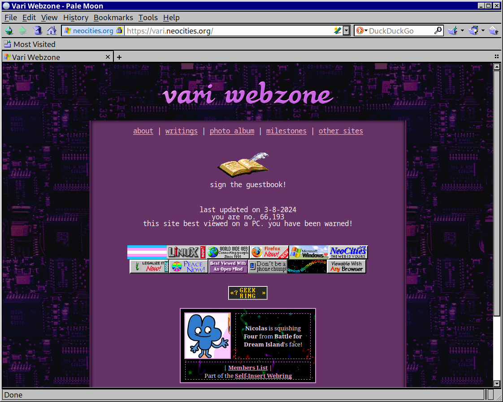
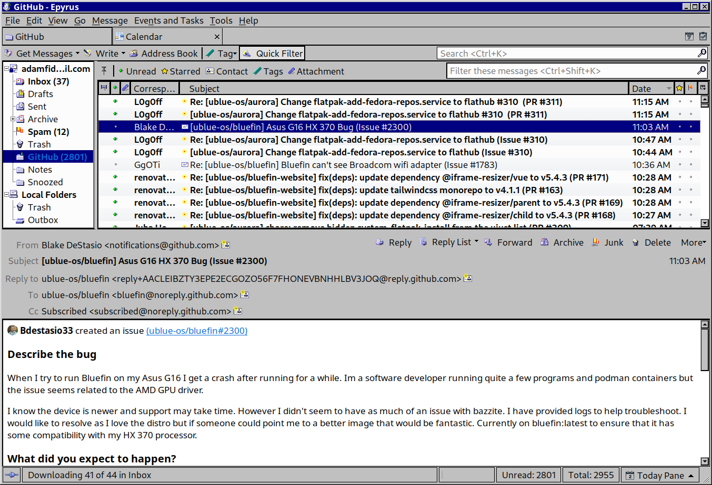
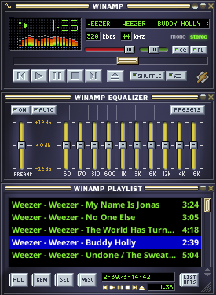
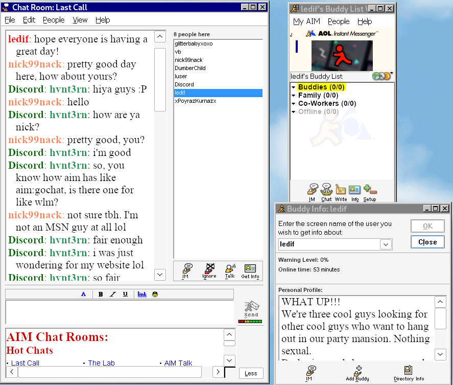
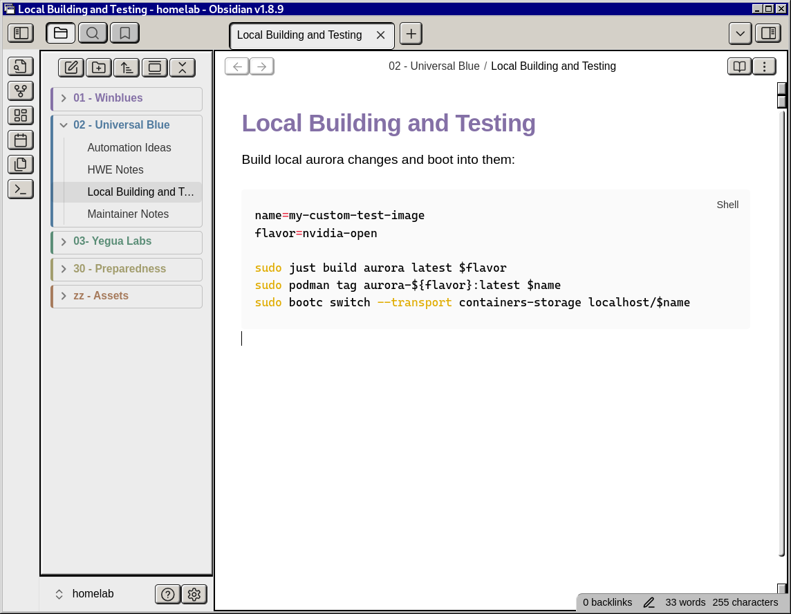
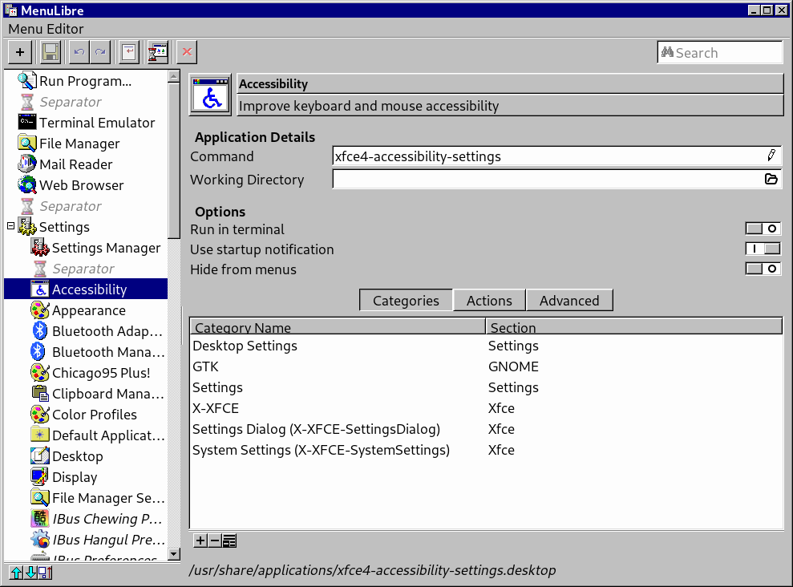
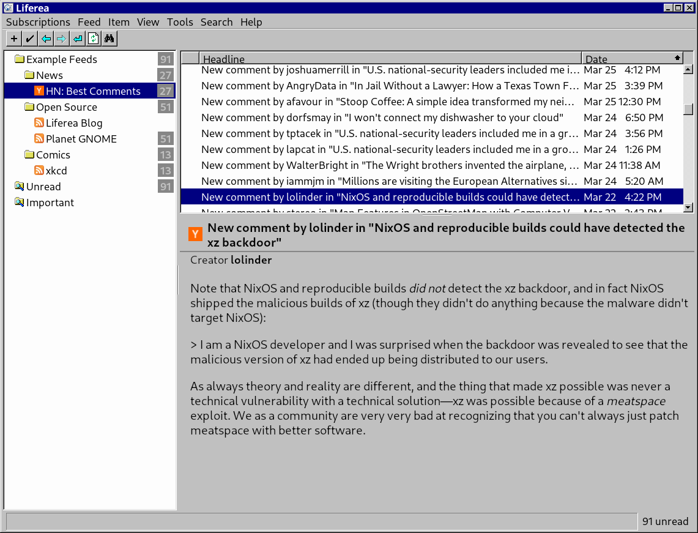
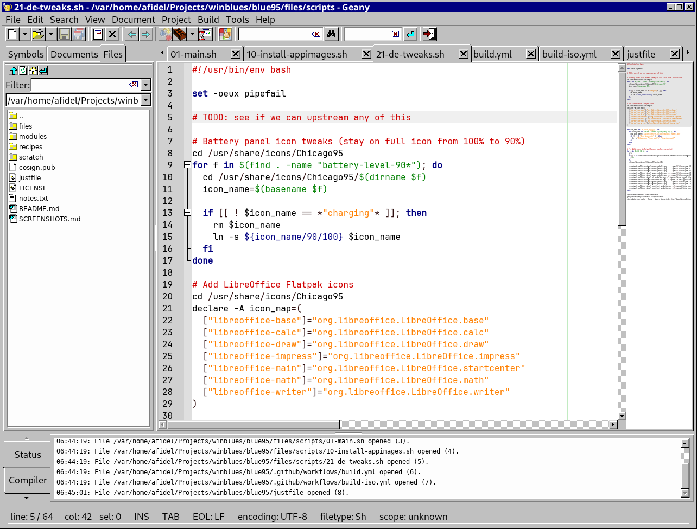

# Pale Moon

<a href="../img/palemoon.png">

</a>

The [Pale Moon](https://linux.palemoon.org) browser is included in Blue95 by default. The [Moonscape](https://addons.palemoon.org/addon/moonscape/) theme must be manually installed.

# Epyrus

<a href="../img/email.png">

</a>

The default mail application is [Epyrus](http://www.epyrus.org). The [Moonscape](https://addons.epyrus.org/addon/moonscape/) theme must be manually installed.

# LibreOffice Writer

<a href="https://blues.win/95/screenshot-libreoffice.png">

</a>
The Chicago95 icon set for LibreOffice Writer is available in Blue95, but it must be installed manually.

First copy the `.oxt` file to a location accessible from within the Flatpak environment such as your home directory:

```bash
cp /usr/share/libreoffice/extensions/Chicago95-theme-0.0.oxt ~
```

Launch LibreOffice Writer and open the Extensions menu by going to Tools > Extensions. Click "Add" and select the file `Chicago95-theme-0.0.oxt` in your home directory. Then, restart LibreOffice when prompted.

Once installed, open the Tools > Options menu, navigate to LibreOffice > View, and under Icon Theme, select Chicago95.

# Audacious

<figure markdown>
<a href="../img/audacious.png">

</a>
</figure>


The Classic Winamp Skin is enabled by default for Audacious. To manually enable it, open the Appearance menu in the Audacious settings and select the `ClassicWinamp` skin.

Audacious has full support for custom Winamp skins, such as those found in the Internet Archive's [Winamp Skins Collection](https://archive.org/details/winampskins). Downloaded skins should be placed in `~/.local/share/audacious/Skins`.

/// tip
If Audacious with a Winamp skin is too small, try enabling Double Size with Ctrl+D.
///

# AOL Instant Messenger

<a href="../img/aim.png">

</a>

/// info
    open: True
Our plan is to include a `ujust install-aim` recipe to automate a lot of this, but here
are the manual steps for now.
///

1. Install [Bottles](https://flathub.org/apps/com.usebottles.bottles), either through the Software Store or with: `flatpak install flathub com.usebottles.bottles`.
2. Create a new Bottle called "AIM" and select "Application."
3. Sign up for an account on [nina.chat](https://nina.chat).
4. Follow the rest of Nina's [Getting Started](https://nina.chat/connect/aim/) guide where you will download, install and patch the AIM client.

# Obsidian


<a href="../img/obsidian.png">

</a>

The popular markdown note taking application [Obsidian](https://obsidian.md) has support for custom themes.

Follow the [Themes Setup Guide](https://help.obsidian.md/themes) to enable themes and install the "Retro Windows" theme.
Additionally, change the Window frame style setting to "Native frame."

# MenuLibre

<a href="../img/menulibre.png">

</a>

[MenuLibre](https://github.com/bluesabre/menulibre) is a tool used to edit and create FreeDesktop.org Desktop Entries
for the Start Menu and Desktop.


# Liferea

<a href="../img/liferea.png">

</a>

Out of the box, the RSS reader application [Liferea](https://github.com/lwindolf/liferea) should have the appropriate theme and icons.

# Geany

<a href="../img/geany.png">

</a>

The lightweight IDE [Geany](https://www.geany.org) has the correct theming out of the box.


