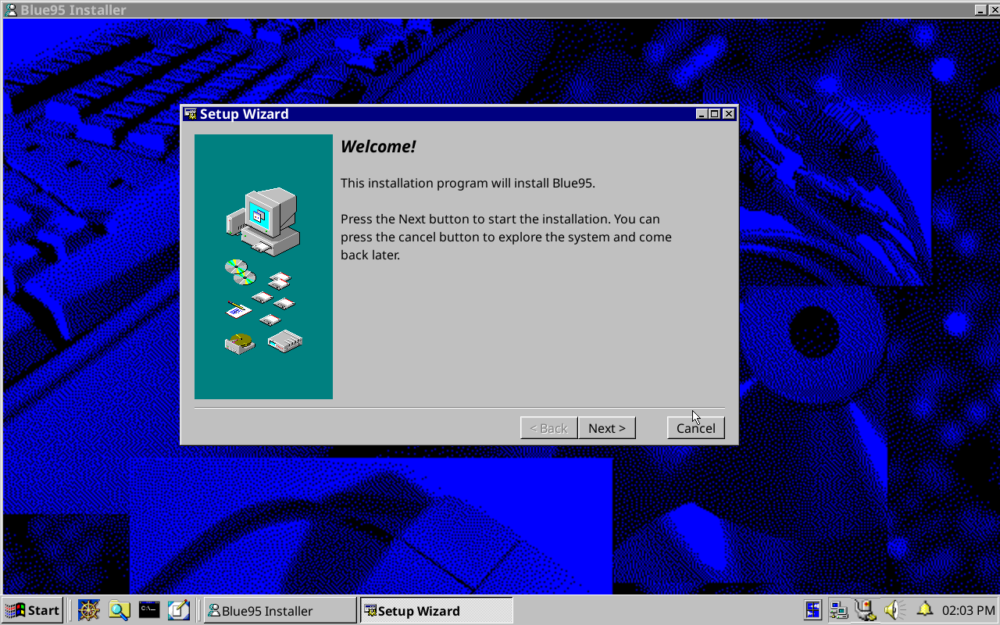

# Installer ISO

/// important
    open: True
There is currently a bug with the Blue95 installer ISO.
///

Due to issues with Blue95's installer ISO, we recommend installing another Xfce-based Fedora Atomic desktop with a working ISO such as [winblues/vauxite](https://github.com/winblues/vauxite). Use [vauxite-base-latest.iso](https://pub-969fbc86b5f24e4d81c6d022e8fd8dde.r2.dev/vauxite-base-latest.iso) to install Vauxite.

After installing Vauxite, you can rebase directly to Blue95:

```
  rpm-ostree rebase ostree-image-signed:docker://ghcr.io/winblues/blue95:latest
```

# From Other Atomic Desktops
If you are currently using another atomic desktop such as [Bazzite](https://bazzite.gg) or [Fedora Silverblue](https://fedoraproject.org/atomic-desktops/silverblue), you can rebase to Blue95.

- First rebase to the unsigned image, to get the proper signing keys and policies installed:

```
  rpm-ostree rebase ostree-unverified-registry:ghcr.io/winblues/blue95:latest
```

- Reboot and then rebase to the signed image:

```
  rpm-ostree rebase ostree-image-signed:docker://ghcr.io/winblues/blue95:latest
```

It is recommended to create a new user after rebasing.

# Live ISO
<a href="../images/installer.png">

</a>

/// warn
    open: True
The installer on the Live ISO is in alpha. Please only use it in a VM or a machine that you are okay with breaking.
///

Download the [Live ISO](https://pub-969fbc86b5f24e4d81c6d022e8fd8dde.r2.dev/blue95-live-latest.iso) and boot into the Blue95 live environment. Click on the "Installer" icon on the desktop to launch the Blue95 Installer.

This installer was thrown together in a couple of days and is essentially just a wrapper around [bootc-install](https://bootc-dev.github.io/bootc/bootc-install.html).

Limitations of Blue95 Installer:

- No confirmation dialogs for destructive operations. Make sure to select the correct drive!
- Hardcoded user creation. Credentials after installation is `cory:topanga`.
- Very little progress information ([bootc-dev/bootc#542](https://github.com/bootc-dev/bootc/issues/542)).
