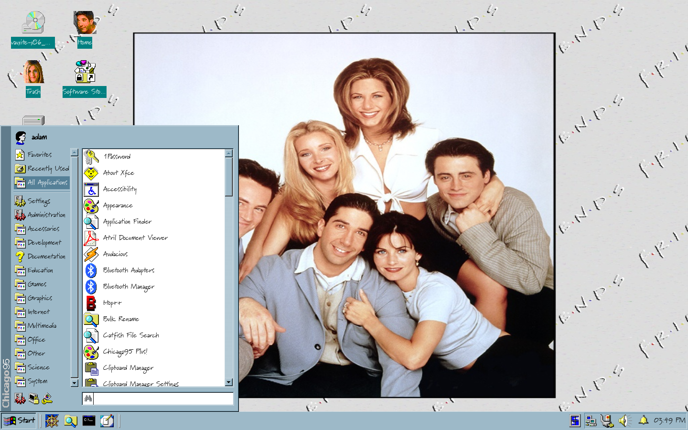

# Chicago95 Plus!

Download any Windows 95, 98, ME or XP theme from the Internet Archive's [Windows Desktop Themes](https://archive.org/details/windowsdesktopthemes) and use this tool to create and apply the theme.

Pictured above is [Complete Friends Desktop Theme Pack](https://archive.org/details/winfiles_cmfriend_202005).

# GUI

The Chicago95 Plus! GUI is designed to look similar to the classic Plus! experience. You can choose exactly which theme options you'd like to install and preview them.

