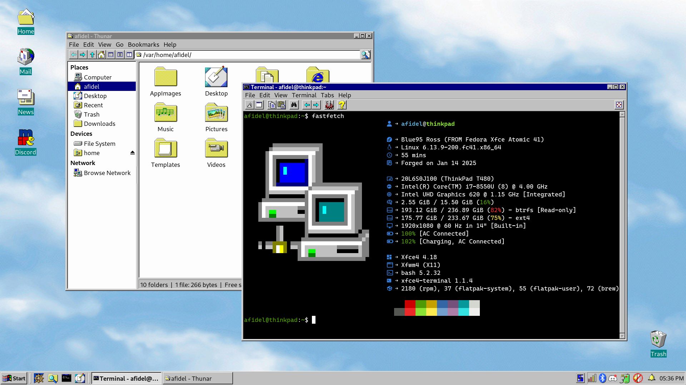

## Main Desktop

## Mail Client

The default mail application is [Epyrus](http://www.epyrus.org), pictured above with the [Moonscape](https://addons.epyrus.org/addon/moonscape/) theme.

## Web Browser

The default web browser is [Pale Moon](https://linux.palemoon.org), pictured above with the [Moonscape](https://addons.palemoon.org/addon/moonscape/) theme.

## Software Development

## Ultrawide Display

